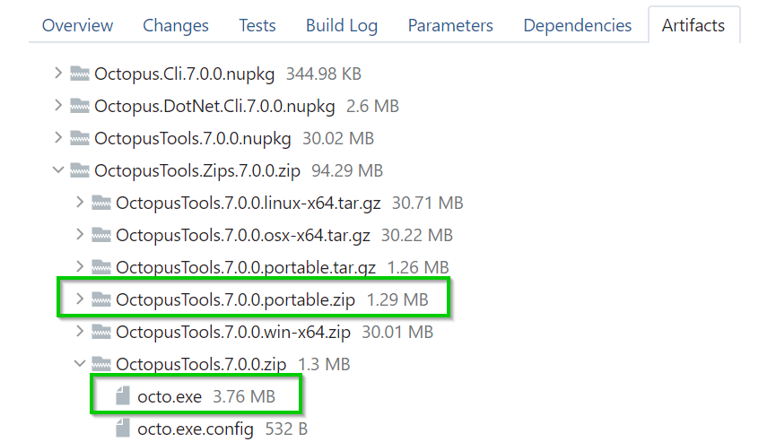
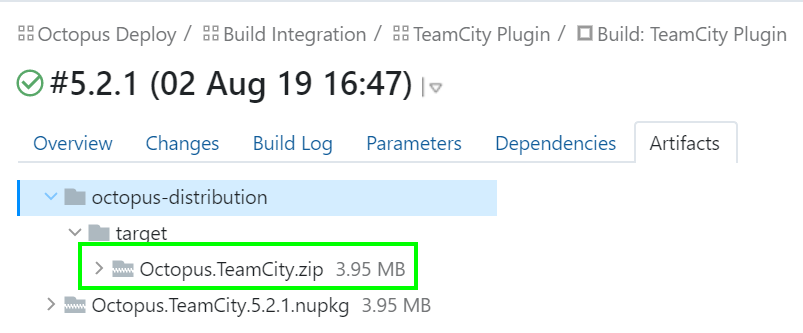
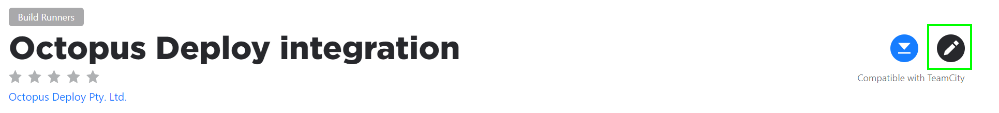

This plug-in allows TeamCity builds to trigger deployments in Octopus Deploy. 

## Get the plugin

Download the plugin from [the Octopus Deploy downloads page](http://octopusdeploy.com/downloads) or the [JetBrains plugins downloads](<https://plugins.jetbrains.com/plugin/9038-octopus-deploy>).

Installation and usage instructions are available in [the Octopus Deploy documentation](http://octopusdeploy.com/documentation/integration/teamcity). 

## Building

To build the plugin from code:

 1. Install the latest version of the JDK
 2. Install TeamCity
 4. Run `gradlew -Dteamcity.distribution=C:\TeamCity clean distZip` (set the TeamCity
    directory to the location where you extracted or installed TeamCity locally). 
    The `gradlew` script will download Gradle for you if it is not already installed.
 5. The plugin is available at `build/distributions/Octopus.TeamCity.zip`

## Editing and debugging in IntelliJ

1. Install TeamCity locally to `C:\TeamCity`. Allow the service to start for the first time, and add an 
   admin user. Then stop the service so it is not running.
2. Give yourself full permissions to the Teamcity Data folder (usually `C:\ProgramData\JetBrains\TeamCity`). 
   This folder may be hidden.
3. Import the Gradle project into IntelliJ.
4. Create a Tomcat Configuration:
    1. Click Run -> Edit Configurations.
    2. Click the plus button and select Tomcat -> Local
       
    3. Click the `Configure...` button next to the `Application Server:` option.
    4. Set the `Tomcat Home` option to the location of your TeamCity installation (probably `C:\TeamCity`).
        
    5. Click the `OK` button.
6. Under the `Startup/Connection` tab, set the `Startup script` to `C:\TeamCity\bin\teamcity-server.bat run` and 
   the `Shutdown script` to `C:\TeamCity\bin\teamcity-server.bat stop`. Do this for both the `Run` and `Debug` 
   environments.
5. Ensure that the `Before launch` list includes the step `Run Gradle Task 'diztZip'`.
6. Run the `copy-plugin.cmd` script as an external tool after the Gradle task. This will copy the plugin to TeamCity.
6. Ignore the `Warning: No artifacts configured` message.
   
7. Click the `OK` button to save your changes.

At this point you can run TeamCity from IntelliJ. If need be you can run TeamCity in debug mode and step 
through the plugin code as it is executed by TeamCity.

## Updating the version of Octopus CLI we embed

If the Octopus CLI has changed such that we need to update the version we embed with the plugin the steps are as follows:

- Locate the build in TeamCity and navigate to the Artifacts tab
- Expand the OctopusTools.Zips.*version*.zip file
- Download `octo.exe` from the OctopusTools.*version*.zip file. Also download the OctopusTools.*version*.portable.zip file
  
- Rename the latter to `OctopusTools.portable.zip` and then copy them into the `\octopus-agent\src\main\resources\resources\3\0` folder, over the existing files

## Publishing a new version to the JetBrains Marketplace

_Currently we manually publish new versions of the TeamCity plugin directly in the JetBrains Marketplace due to the lack of support for specifying release notes as part of publishing via `cUrl` or `gradle`, once they've [added support for this](https://youtrack.jetbrains.com/issue/MP-2369) we will automate this part of the process._

1. Tag `master` with the next `major.minor.patch` version and wait for the tag to be built by TeamCity
2. Download the `Octopus.TeamCity.zip` artifact from the TeamCity Plugin build
    
3. Login to the [JetBrains Marketplace](https://plugins.jetbrains.com/plugin/9038-octopus-deploy-integration) using the "Jetbrains account" credentials from the password manager.
4. Click the `Edit` button in the top right corner
    
5. Choose the artifact that you downloaded from TeamCity
6. Leave the `Channel` as `Stable`
7. Enter the release notes for the version of the plugin that your creating. **Note:** The `Change Notes` field does not support `Markdown` it only supports `Html`.
8. Click `Upload new build` to publish the new version of the TeamCity plugin

## Using Docker
Some docker files have been provided to assist development for users who may not have all the prerequisite tooling available on their local machine for development. This process will currently be slower and does not provide the benefits of debugging at this point in time.
1. Run `docker-compose -f docker-compose.teamcity.yml up -d` to allow the TeamCity server and agent spin up. This will take some time to initialize and will store the configuration files under `./docker-files`. This will allow for both restarting the server without the full initialization and to pass in the Octopus plugin.
2. Once the server has started navigate, to the instance via http://localhost:8111 and create an admin login (this setup only needs to take place once due to the configuration mount). Once the server starts up, navigate to `Agents`->`Unauthorized` and authorise the agent that was started in a container alongside the server.
3. Build the plugin by running `docker-compose -f docker-compose.build.yml up`. This will use a gradle image, mount the current directory and invoke the `gradlew` command described above. At the end of the build the plugin will be copied into the TeamCity plugins directory created by the container in the previous step.
4. Once the plugin has been built, you will need to restart the server by running (depending on your environment) `docker restart octopus-teamcity_teamcity-server_1`.
5. When testing with a connection to an Octopus Server instance on your local host instance, you can use the special `host.docker.internal` route. e.g. http://host.docker.internal:8065
   